# standard ebooks how-tos


## initial tool setup 

### **Typora**:

 for my own notes, installed typora and activated my license: the license code is in my quaderno di lavoro.

### **Xcode**: 

it seems you need to install Xcode before you install homebrew. (note, I looked at this tutorial https://www.geeksforgeeks.org/installation-guide/homebrew-installation-on-macos/, however note the spacing on some of the commands given is wrong)

1. Installed Xcode command line tool:  Open **Finder**, then from **Go** menu select **Utilities** and open **Terminal**  (nb you can also open terminal from apps I think)
2. then in the terminal window paste `xcode-select --install` and choose Install, accept the terms
3. Verify Xcode installation in terminal with `xcode-select -p` 

### **Homebrew**:

Now as per the website brew.sh, the terminal command for installing homebrew is: 

```
/bin/bash -c "$(curl -fsSLhttps://raw.githubusercontent.com/Homebrew/install/HEAD/install.sh)"
```

I had to enter my mac password to proceed.


it tells you what it's going to do and then you press enter to proceed. 

To verify the installation use `brew doctor`

And to update it use `brew update`

  

### **Standard ebooks tools**

Finally, you can now use homebrew to install the standard ebooks toolset with: 

```
brew update
brew install standardebooks
```

It takes a while to complete, then you can check the outcome with 

```
se --version
```

Nb it is not clear in the instructions if the pipx instructions are an alternative to the ones using homebrew, I think they are. The above steps do not themselves install pipe

Presumably the other commands you can use are 

To update, the instructions say to use `pipx upgrade standardebooks`

but I suppose for an installation with homebrew you would instead do:

```
brew upgrade standardebooks
```

nb I tried this command and it seemed to work, it told me I already had the latest version installed

### github desktop (intall only)

This isn't strictly necessary but it might help with authentication and viewing diffs, and I don't want to install VS code just yet.

**Installation**:

I downloaded github desktop for macbook (intel chip) from here: https://desktop.github.com/download/. This downloads a zip. You double click to extract it and then end up with the application file in the downloads folder, which you then copy to your applications folder in Finder. 

When I launched Github desktop it automatically asked if I wanted to use my github account (acnard, etc.) and I said yes, and had to enter my password for it (the same one I used to sign in to github). Then it asked me to configure git with my account name and email address. 

I didn't accept the defaults offered (the github account name and email address) and instead used just Anna Nardella and nardella.anna@gmail.com. 


### code editor

I also installed Cotedit from the apple store. This is needed when you later want to edit the various ebook files. (You could use typora in source mode but it's not really a code editor and lacks the needed features, eg show invisible characters etc.)

## new repository for testing

I will do this on the command line, not using github desktop, to review my knowledge.

### Create new repo on GitHub

over on GitHub I created a new repository called mac-setupnotes for holding the text in this file. 


### upload files to github and do inital commit

Now I want to populate this repo with the contents of my SetupNotes folder on the mac


I decided to do this in the only way I know how, meaning I first upload my files (so this .md file plus its images) to the repository on GitHub. So I uploaded all the files in my SetupNotes folder and made an initial commit (directly on github)


### now clone the github repo to local machine

Now I can use a git command to clone this repo to my local machine. 

So to do this, I need to cd into the folder where I want the repo to be cloned and then use the git clone command. In my case: 


So to do this I cd into the folder I want to use (MyNotes)

and then enter the command `git clone https://github.com/acnard/mac-setupnotes.git`

where the https address is obtained from github.


after doing this, I can cd into the newly created subfolder (called mac-setupnotes) and do a git status: it tells me I am up to date with origin.


### update the files on local machine

Now I have been working on the old setup notes folder where I have been taking notes. I need to move those changes (updated .md file plus new images) to the mac-setupnotes folder that is under version control, after which  I can delete my initial setupnotes folder. 

Then I can do a `git add -A` followed by a `git commit` and a `git push`.


I was able to do the commit using the -m option to enter the commit message directly in the terminal: 


but then the git push failed. It asked me for my github user name and pw but then said that :

> remote: Invalid username or token. Password authentication is not supported for Git operations.fatal: Authentication failed for 'https://github.com/acnard/mac-setupnotes.git/'

### create a token on github 

You can no longer use your username and pw to do a git push from local to remote. Instead, you need to generate a token on github and then, when prompted for your pw on git push paste in that token. Note that the token has an expiration date.

Following the instructions here:


I created a personal access token in GitHub


And then copied it to a file on my local machine (you can't access this token again on github).

### do a git push to remote using the token

Then, when after git push, when prompted for my credentials entered acnard for username and then pasted in the token for the password (CAREFUL: do command-V only once, it doesn't show you anything in the command line when you paste). 


## Summary of git process (command line)

This is assuming you have a repo whose origin is a remote on github and you have cloned it to the local machine using https. 

### Tip: Open terminal at desired folder

Navigate to the folder in Finder and then right click and select **New Terminal at Folder.**

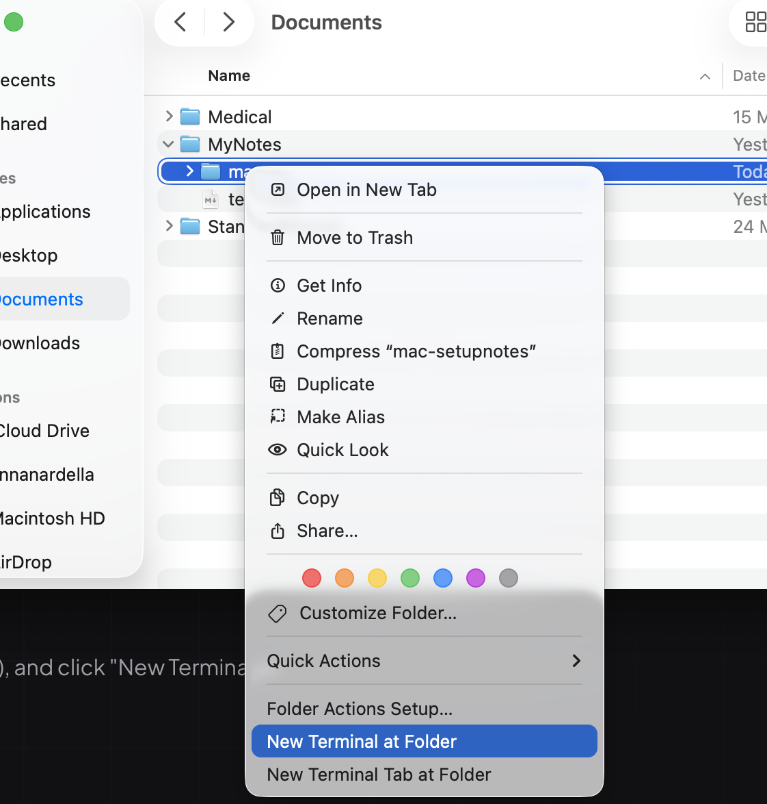

### making changes only on local and pushing to remote

1. On your local machine, always do a **git fetch** first to retrieve any changes from the remote (especially if you work on the same repo from multiple computers)

2. Then work on the files in your local folder (in this case, mac-setupnotes), updating or adding files as needed. 

3. When you do a **git status** you will be shown the non-commited changes you have made.
   

4. Use **git add -A t**o add all chanced or new files to the staging area. Then with **git status** you will see that all those files are staged for the next commit. 

   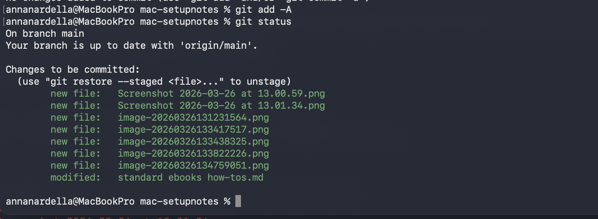

5. Now you can do **git commit** **-m "enter message here"** to commit those changes (You need the -m option if you have not set up a default editor). 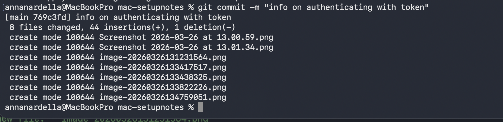

6. Finally, do a git push to publish those changes to the remote. 

   NOTE: The second time I did this, at least in the same terminal window, I didn't have to re-paste my github token.

### making changes also on remote

Now suppose you do a change directly on github: 

1. You edit the file on github and then do the commit there. 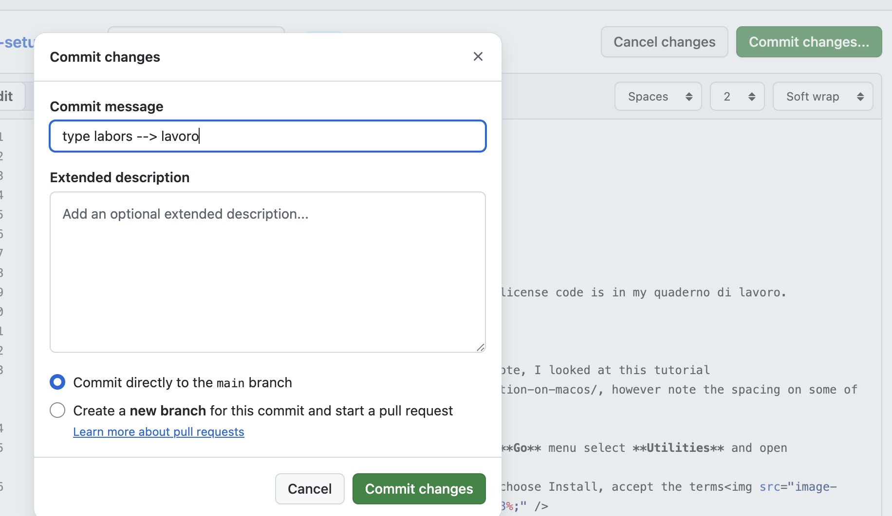
2. Then notice that, on local machine, if you do git status **it won't notice about the change done in the origin**. Right now it's only showing the non-commited changes I've done on the local machine. But it says the commits are up to date: 
   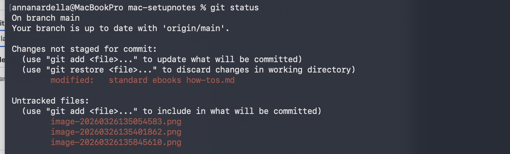
3. This is because you need to first to a **git fetch**. If you do that, then git status will tell you the correct situation. Basically, there is on commited change on the origin, and I need to do a git pull to update my local branch with those same changes. 
   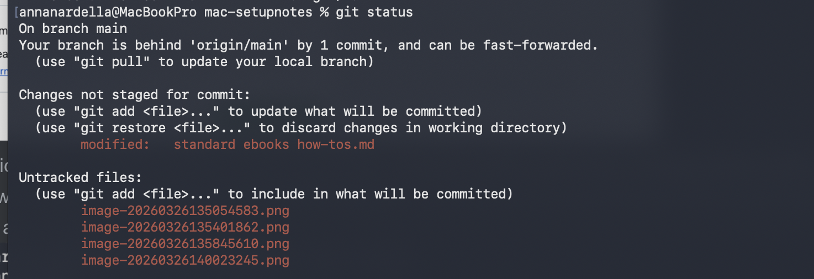
4. But if I try to do a git pull now, it warns me that the git pull would be overwritten by my local changes to the same .md file. 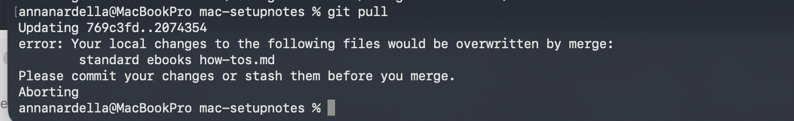
5. I try to commit my local changes but then I still can't push them. I've ended up in a situation with divergent changes on local and remote. Basically, I have one commit on the remote and a different commit to the same file on local. Following these instructions

   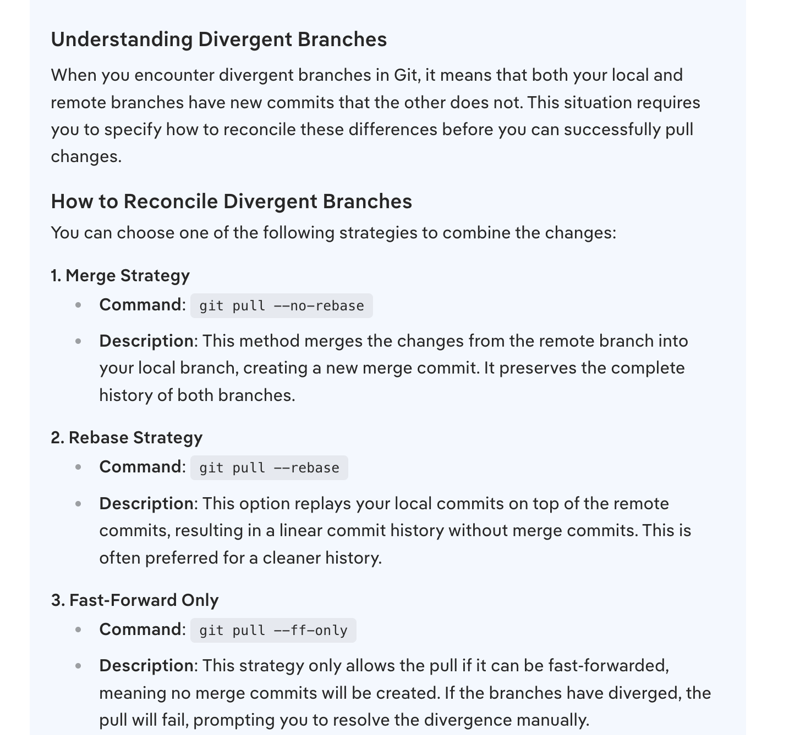
   I did a **git pull --rebase**. This basically means (I think) that it does the remote commit first and on top of that my local commits. And those two sequential commits are now on my local machine. I still need to do a **git push** to publish the result to the remote. 
   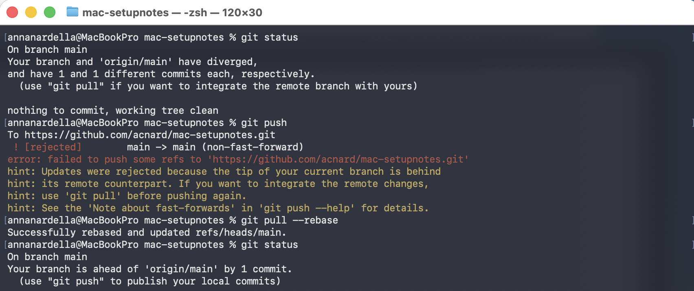

### About remote and origin

see quote from geeksforgeeks article below. In my case there is one remote (the one on GitHub and my local repo is pointing to it as its origin). I can check this with the **git remote -v** command:

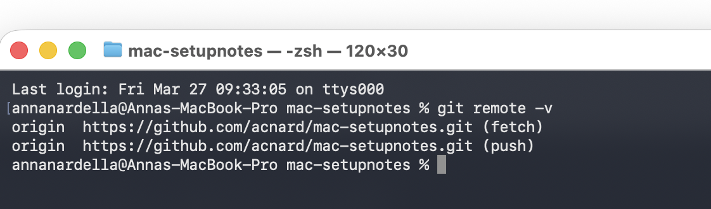

>  **Overview of Git and Remote Repositories**
>
> A [remote repository](https://www.geeksforgeeks.org/git/how-to-reset-a-git-branch-to-a-remote-repository/) in [Git](https://www.geeksforgeeks.org/git/git-tutorial/) is a version of your project that is hosted on the internet or another network. It serves as a centralized location where developers can push their changes and pull updates. This setup is important for collaborative development, ensuring all team members have access to the latest code.
>
> **What Does "origin" Mean in Git?**
>
> In Git, "origin" is a conventional name used to refer to the default remote repository where your code is stored. It is not a reserved keyword but a naming convention that Git automatically assigns when you clone a repository. Understanding "origin" helps in managing remote connections effectively. 
>
> **How "origin" is Automatically Created When Cloning?**
>
> When you clone a repository using the git clone command, Git automatically creates a remote called "origin" that points to the URL of the cloned repository. This setup saves you from manually adding the remote and ensures that you can immediately begin interacting with the remote repository.
>
> ```
> git clone https://github.com/user/repository
> ```

## Github desktop - work with existing repo

Now that I have the repo created and ready, I can try interacting with it using github desktop:

### Add the repo to github desktop

The problem is, it seems that adding an existing repository to Github desktop may create a new remote for it on GitHub? But I already have all that... 


I asked chat gpt and got the below instructions: So I picked **Add an existing repository from the local drive** and then selected the folder **mac-setupnotes**. 
Then I also did the check (menu > **Repository > Repostitory Settings** ) and verified the origin was correct:

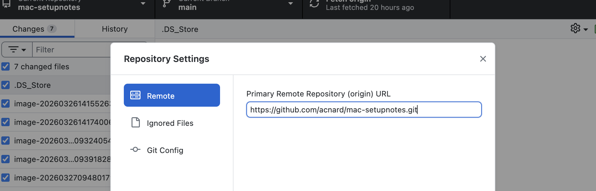

> You don’t need to create a new remote repo at all—since your project already has a GitHub remote, you just need to **add the existing local repository to GitHub Desktop**.
>
> Here’s how to do it:
>
> **Option 1: Add existing repository**
>
> 1. Open GitHub Desktop
> 2. Go to **File → Add local repository…**
> 3. Click **Choose…** and select your repo’s folder (the one with the `.git` directory)
> 4. Click **Add repository**
>
> That’s it—GitHub Desktop will detect the existing Git setup, including your remote.
>
> **Important check (optional but recommended)**
>
> After adding:
>
> 1. Go to **Repository → Repository settings… → Remotes**
> 2. Confirm that `origin` points to your existing GitHub repo (e.g., `https://github.com/username/repo.git`)
>
> ------
>
> **If the remote is missing (rare case)**
>
> If for some reason the remote isn’t there:
>
> ```
> git remote add origin https://github.com/username/repo.git
> ```
>
> Then GitHub Desktop will pick it up automatically

### Now my repo looks like this on github desktop

I see that it is doing fetch from origin automatically (there is also a menu command to fetch manually). It seems to have found the modified .md file plus six new image files.  This corresponds to what I see when I do a git status (the slight discrepancy in the screenshots is because as I am taking notes I am adding more new images to the repo! I see that whenever I add a new image, GitHub desktop automatically adds it to the list:  

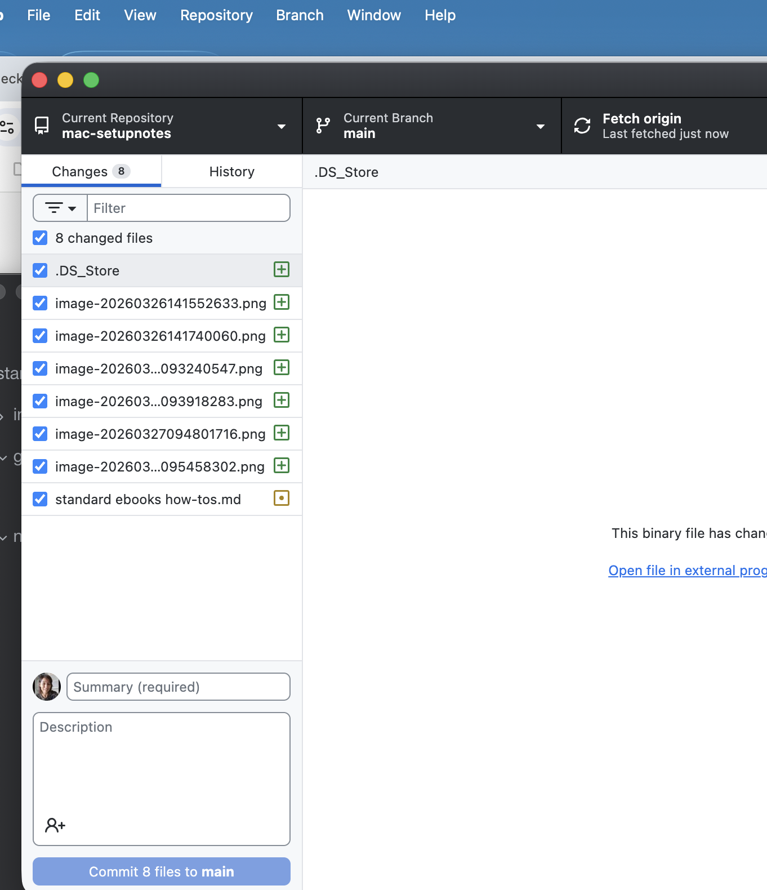

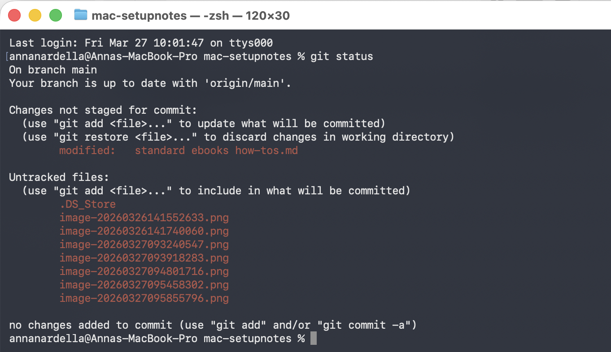


### do a commit from github desktop

So the **Changed files panel** is both new (untracked) files and existing (already tracked) files that have been changed. You can use the checkboxes to select which of the files you want to include in your commit (and I suppose it will automatically do the git add for those). Also when you select a file it's very nice, you can see all the diffs.


so I selected all the files, put in my commit message, and clicked **Commit 10 files to main**. After this, in the History tab I can see my new commit..

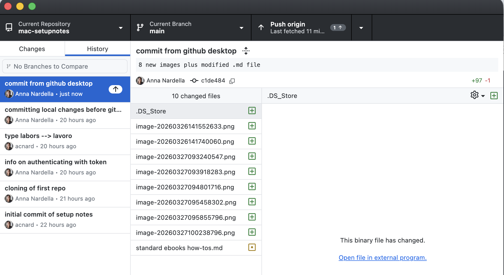

and in the **Changes** tab it tells me there are no local changes any more, and suggests I should do a push. When I clicked **Push origin,** it did the push without any trouble (no authentication prompt). And over on github I can verify that all my changes are there.

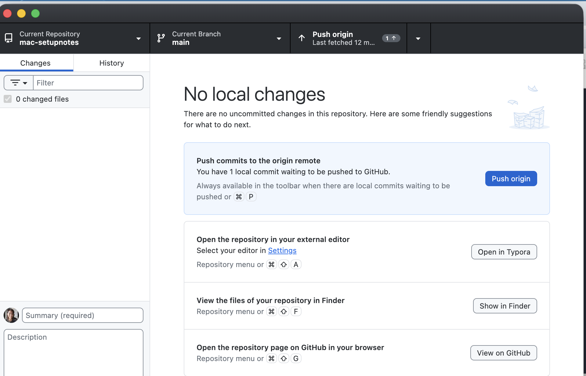

##  Standard ebooks Test run for the Grey Mask

For my first production I will produce a book only for myself. I found the Grey Mask here, done by distributed proofreaders in Canada:

Text: https://www.fadedpage.com/showbook.php?pid=20140339 

Scans: https://archive.org/details/bwb_W9-ANO-109/page/192/mode/2up 

The book is published in 1929 so is out of copyright also in the US

### select the starting file to use

There are both html and epub versions. The instructions say to pick the one that appears most accurate. 
In this case the epub and the html seem pretty much the same. I decided to start with the epub.

### create epub skeleton for the book

I will use the "without pg id" option because I am not sure of the project gutenberg id of this book (I got it from distributed proofreaders Canada)

In the instructions they give the following example:

```
se create-draft --author "Robert Louis Stevenson" --title "The Strange Case of Dr. Jekyll and Mr. Hyde"
```

NB. I have a parent folder in documents called **standard-ebooks** underneath which I want to keep my ebook projects. So I will launch my command inside that folder, as it will then create the appropriate subfolder. 

--> Note that if the book had a translator I would have to add that also in the create draft command

```
se create-draft --author "Patricia Wentworth" --title "The Grey Mask"
```

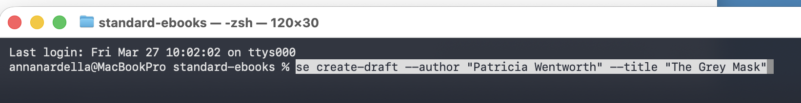

And I can see in Finder that the folder containing the book skeleton is created:

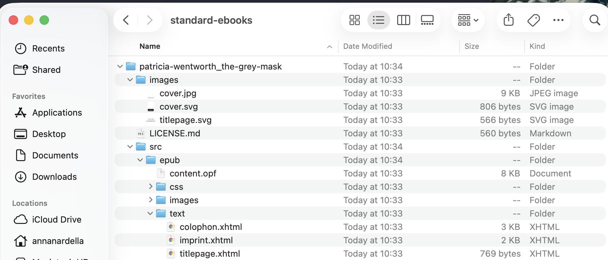

I can also see with a git status that it's created a local git repository in the book folder. 

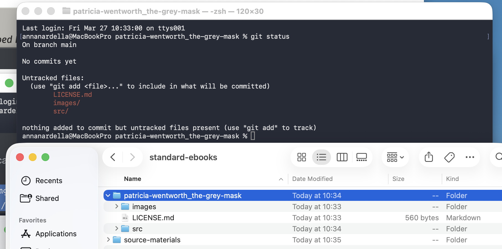

### Add the ebook text to the skeleton (body.xhtml)

The step by step says to add the html file of the book in the **src>text** folder and rename it **body.xhtml**. So from the [faded pages website](https://www.fadedpage.com/showbook.php?pid=20140339) I downloaded the zipped html of the grey mask and then expanded it to get an html file. (I am doing all this in a separate folder called source-materials.)

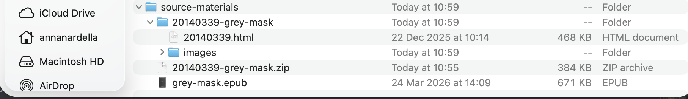

Then I copied the html file into the text location and renamed it body.xhtml.

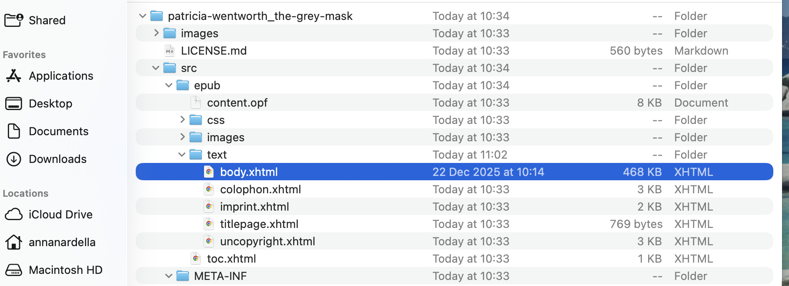

### check the encoding of the body.xhtml file

for this you can use the terminal command **file -I body.xhtml** 
or **file -I src/epub/text/body.xhtml** if starting from a different location. And I see the encoding is utf-8. Otherwise, we would have had to convert.

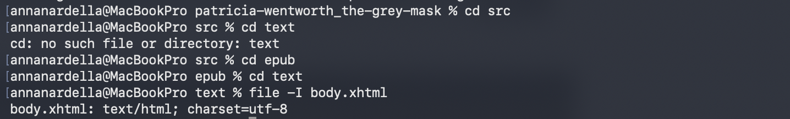

### Do other checks on skeleton files (pre first commit)

Since I did not use the pg-id option when creating the draft, I will not have the information automatically populated. The step-by-step says:

> Because Project Gutenberg ebooks are produced in different ways by different people, `se create-draft` has to make some guesses and it might guess wrong. Make sure to carefully review the data it prefills into `./src/epub/text/body.xhtml`, `./src/epub/text/colophon.xhtml`, and `./src/epub/content.opf`.
>
> In particular, make sure that the Project Gutenberg license is stripped from `./src/epub/text/body.xhtml`, and that the original transcribers in `./src/epub/text/colophon.xhtml` and `./src/epub/content.opf` are presented correctly.

**Colophon**: `./src/epub/text/colophon.xhtml`

I wasn't sure how to fil in these, I put in just a few things like the book's publication year (1929) and the transcriber info (dp canada) and the page scan source info.

**Content.opf** I also had no idea how to fill in all this metadata so for now I just left it as is.

**Body:** `./src/epub/text/body.xhtml`: ok as I copied this in myself and checked the encoding. However it says to also strip the header markup, project gutenberg license, and work title, any in-text TOCs, and anything after the public domain text ends. See instructions pasted below. 

So, I decided to remove everything in-between the <head> tags :

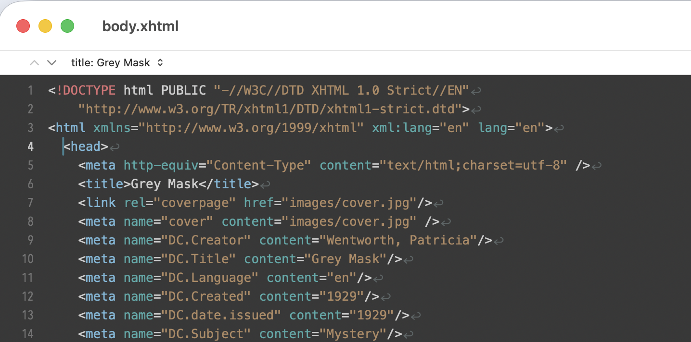

And then at the beginning of the file <body> some more text unrelated to the actual public domain text of the book.

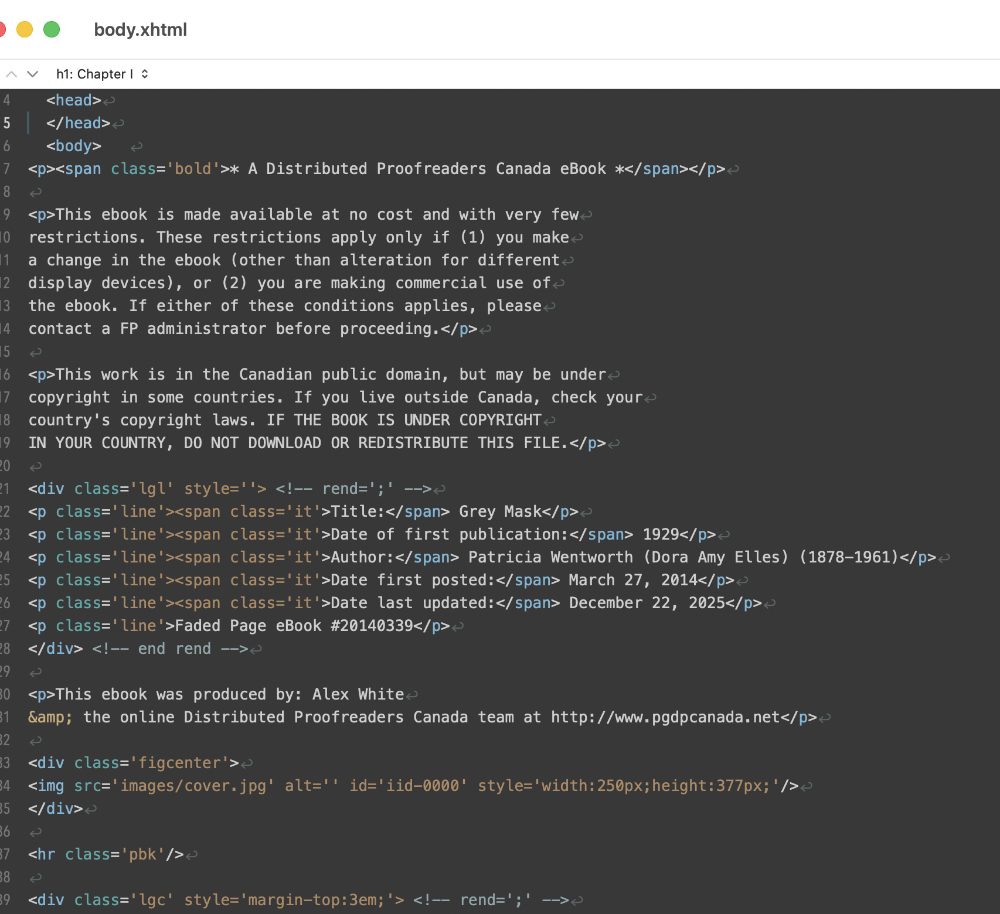

So that I ended up with a file that starts like this. I don't know if I should also altogether have removed the other html file tags at the top (ie to have the file start directly with <h1> chapter 1, which is what it shows in the step-by-step example)

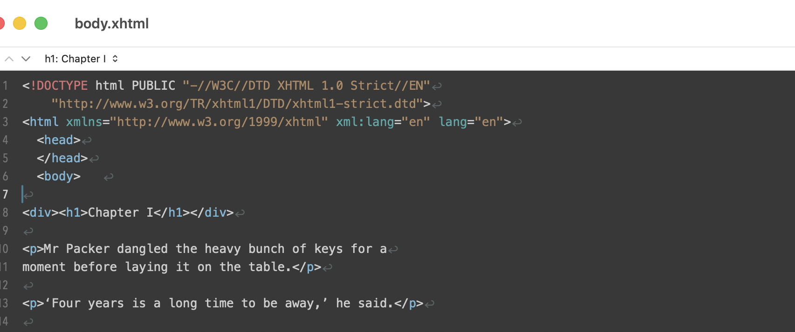

From the end of the file, as per instructions, I removed "The end" and the transcriber's notes. But I left in the closing <body> and <html> tags as I had left in the opening ones

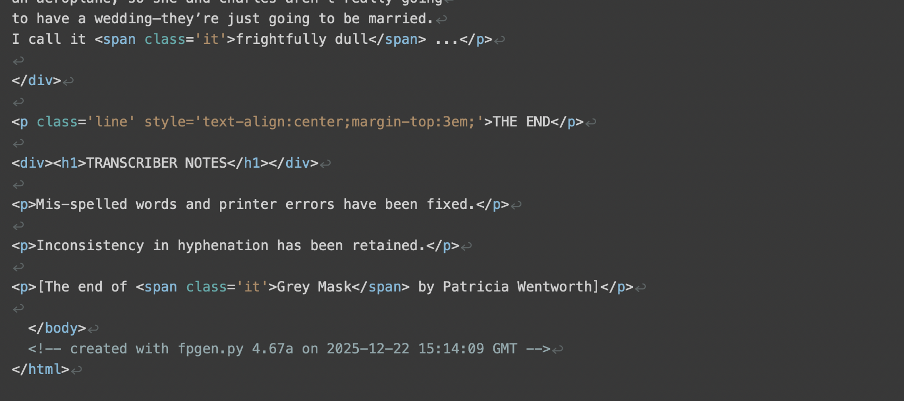

> Now that we’ve got the source text, we have to do some very broad cleanup before we perform our first commit:
>
> - Remove the header markup and everything, including any Gutenberg text and the work title, up to the beginning of the actual public domain text. We’ll add our own header markup to replace what we’ve removed later.
>
>   *Jekyll* doesn’t include front matter like an epigraph or introduction; if it did, that sort of stuff would be left in, since it’s part of the main text.
>
> - This edition of *Jekyll* includes a table of contents *within the body text*; remove that too. S.E. ebooks place the ToC in a separate file outside of the body text, where it can be displayed by the ereader software via UI elements.
>
> - Remove any footer text (e.g. “The End”), as well as any markup after the public domain text ends. This includes the Gutenberg license—but don’t worry, we’ll credit Gutenberg in the colophon and metadata later. If you invoked `se create-draft` with the `--pg-id` option, then it may have already stripped the license for you and included some Gutenberg metadata.

### initial commit

now that I have done the rough cleanup I am ready for the initial commit. At present I still have only the local repo, so I will do this from the command line:

So first I did a `git add -A`: 
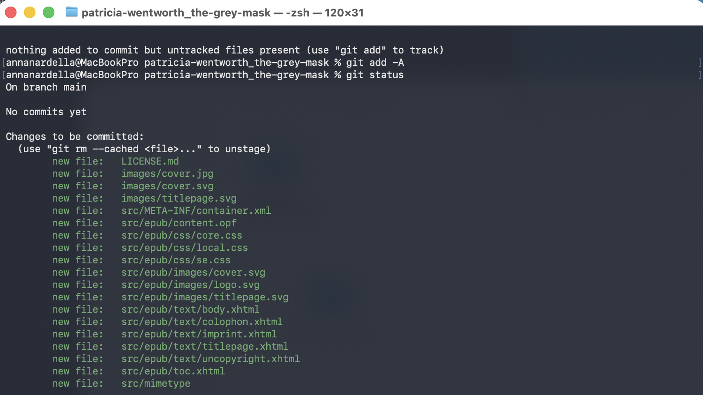

Followed by a `git commit -m "Initial commit"`
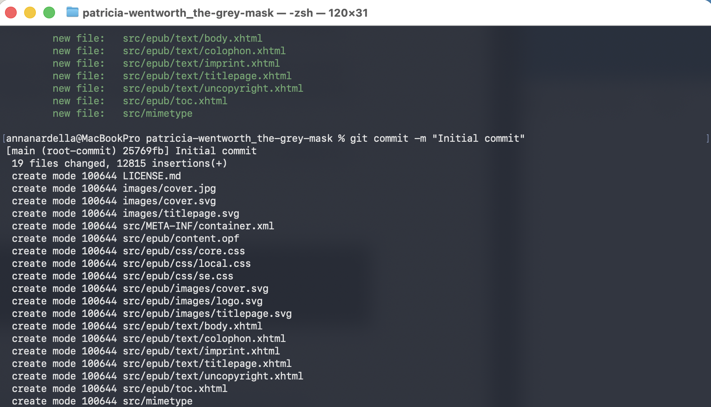

### Split the source text

Now we want to split the source file at logical divisions (in our case, chapters).

We will do this with a standard ebooks command that works as follows.

> To split the work, we use `se split-file`. `se split-file` takes a single file and breaks it in to a new file every time it encounters the markup `<!--se:split-->`.

For this to work, we must first insert `<!--se:split-->` at the appropriate points of the source file.  In this particular book, each chapter is enclosed in `<div>` and `<h1>` tags. And apart from these chapter headings, there are no other div or heading tags in the file. 

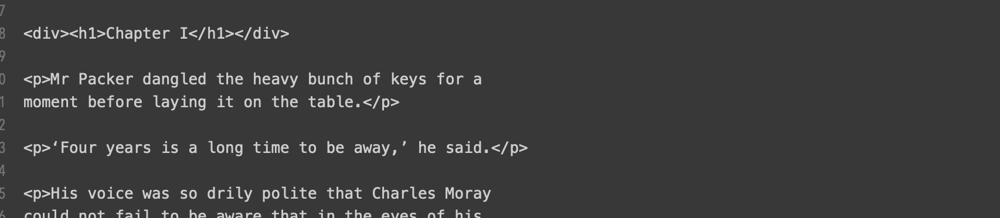

In COTedit we can achieve the insertion of the splitter tag at each chapter using the find and replace function (remember to do it all in one go with replace all, otherwise you will get duplicate splitter tags:

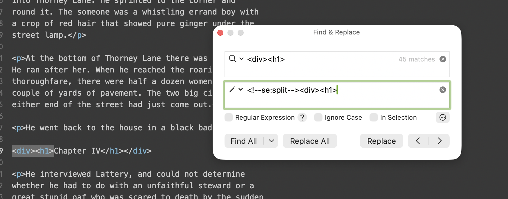

Now we can run the splitter command

```
se split-file src/epub/text/body.xhtml
```

The result is a bunch of chapter files which it places directly in the book folder (where we ran the command). 

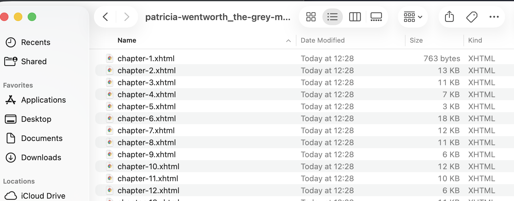

But what happened is there are 46 files (even though we had 45 chapters), this is because I left in the opening html tags etc. So I end up with a chapter 1 file that contains just some tags, and then the actual chapter 1 is in the file named chapter 2, and so on. 

This is no good, so I'll delete all these chapter files, re-clean up my body file, and try again.

So now I'll remove all the html tags as well from the beginning and end of the body file, so that  it really just starts directly with chapter 1.

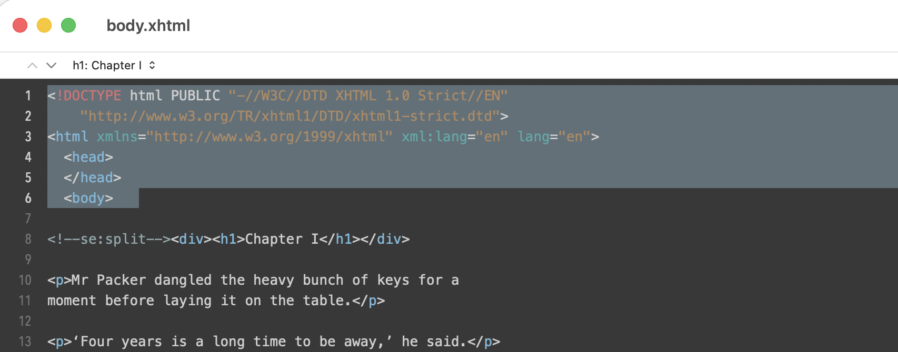

I still have the splitter tags in the body file so I can just run the command again, and this time I get the correct 45 chapter files. Now we can move those 45 files into the **src>epub>text** folder and remove the body file from there. 

(NB on mac press command while dragging to do a move operation)

Now each chapter file looks like this, you can see it's added the html and body tags back again, as also a section tag that encloses each chapter.  
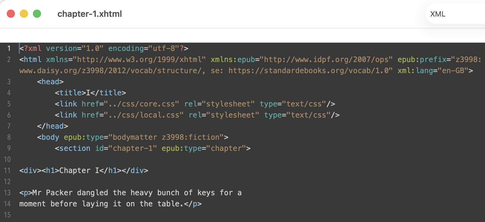

I did another commit here, before further cleanup. with the message "split body into chapters"

### clean up of chapter files

Now I can run the `se -clean` command. Though I am not sure that it'll take care of the fact that I have `<h1>` headings in each chapter file: According to the style guide, they should be h2 because each level has to make sense in the overall structure of the book, and only the book title is h1:

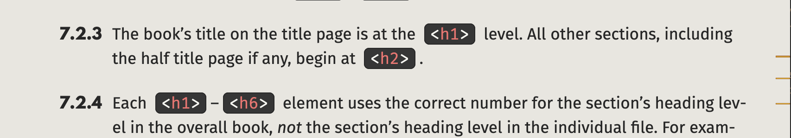

We can run the se -clean command from the root directory of our book, and pass it a dot as the argument: 

```
se clean .
```

I can see from the result that the clean command didn't fix my headers, so I'll do a search and replace in each file so that each chapter is enclosed in <h2> tags, without the extraneous divs. (NB it would've been easier do this before splitting)
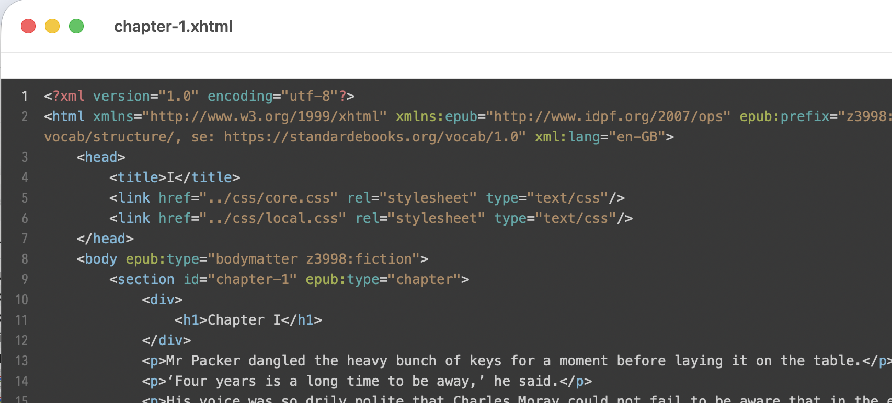

Then after running se clean and doing the manual fix of the h2 headings in all the files, I did another commit, "clean and fix h2 headings"

### add  local repo to gh desktop and publish to GitHub

Now I want to try working with this repo (which only exists locally) on github desktop. 

I used the command File> Add local repository and then selected the folder of the miss silver book. 

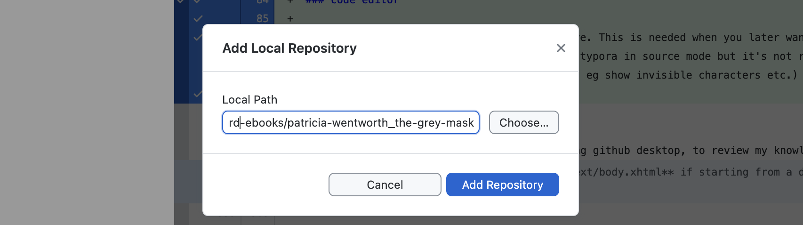

After doing this, I can work with this local repo in the usual way (view the commit history, etc) and it also offers to publish it to github, which I did. 

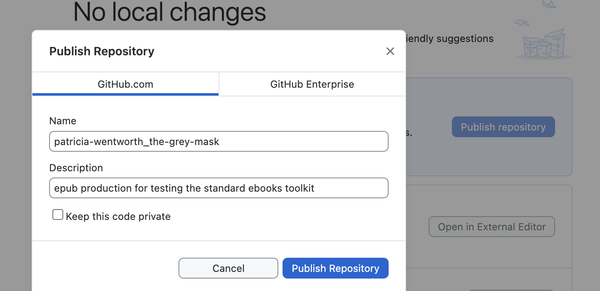

And that's it. When I go look, the repo is present in my github account. 

And here is my commit history so far:

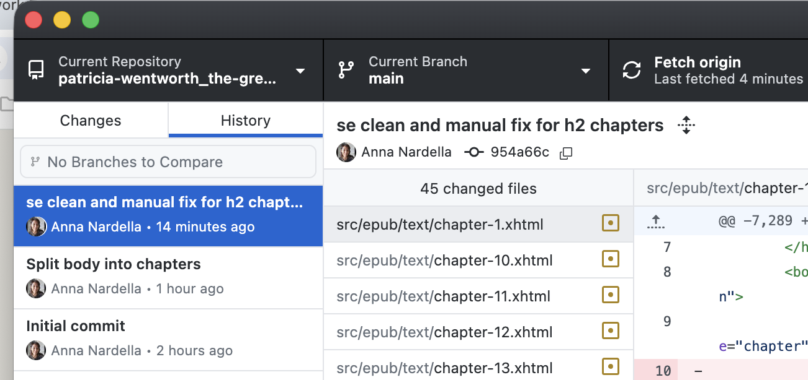

### Typogrify

Next, in the root directory of the ebook, we run the **typogrify** command (the dot argument is because you are already in the required folder). This will, among other things, convert straight quotes to curly quotes.

```
se typogrify .
```

and right after this a commit 

```
git add -A
git commit -m "Typogrify"
```

The result of this seems mainly changes to do with hyphens and dashes, and adding periods to abbreviations like Mr and Mrs. But it didn't touch the quotes because my book has English style quotes (dialogue enclosed in single quotation marks). To fix this I need to run a separate command:

### Convert British to American quotations

This script attempts to convert british (single) quotations to American (double) ones. The text must already be typogrified for this script to work.

```
se british2american .
```

