# standard ebooks how-tos


## initial tool setup 

### **Typora**:

 for my own notes, installed typora and activated my license: the license code is in my quaderno di lavoro.

### **Xcode**: 

it seems you need to install Xcode before you install homebrew. (note, I looked at this tutorial https://www.geeksforgeeks.org/installation-guide/homebrew-installation-on-macos/, however note the spacing on some of the commands given is wrong)

1. Installed Xcode command line tool:  Open **Finder**, then from **Go** menu select **Utilities** and open **Terminal**  (nb you can also open terminal from apps I think)
2. then in the terminal window paste `xcode-select --install` and choose Install, accept the terms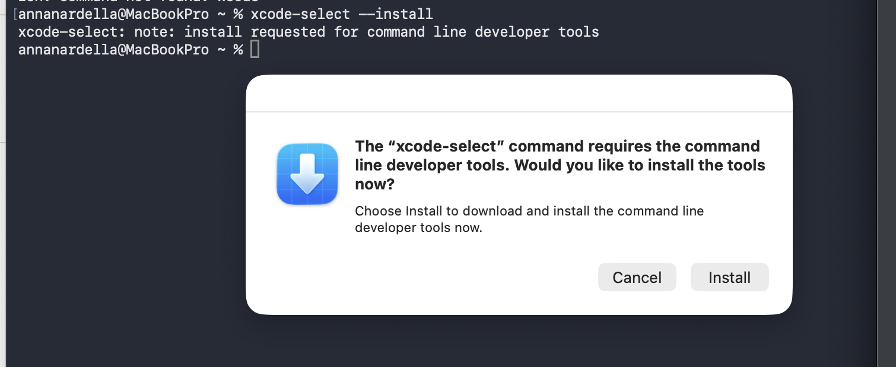
3. Verify Xcode installation in terminal with `xcode-select -p` 

### **Homebrew**:

Now as per the website brew.sh, the terminal command for installing homebrew is: 

```
/bin/bash -c "$(curl -fsSLhttps://raw.githubusercontent.com/Homebrew/install/HEAD/install.sh)"
```

I had to enter my mac password to proceed.

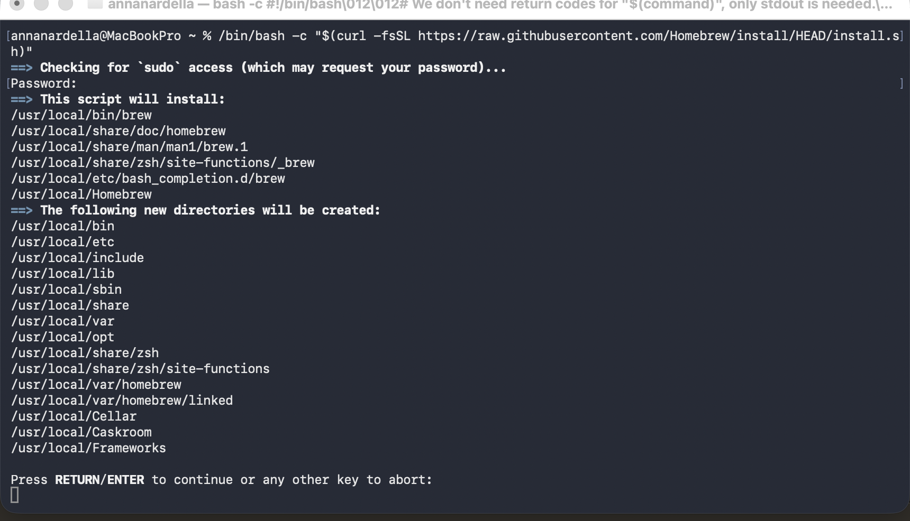

it tells you what it's going to do and then you press enter to proceed. 

To verify the installation use `brew doctor`

And to update it use `brew update`

  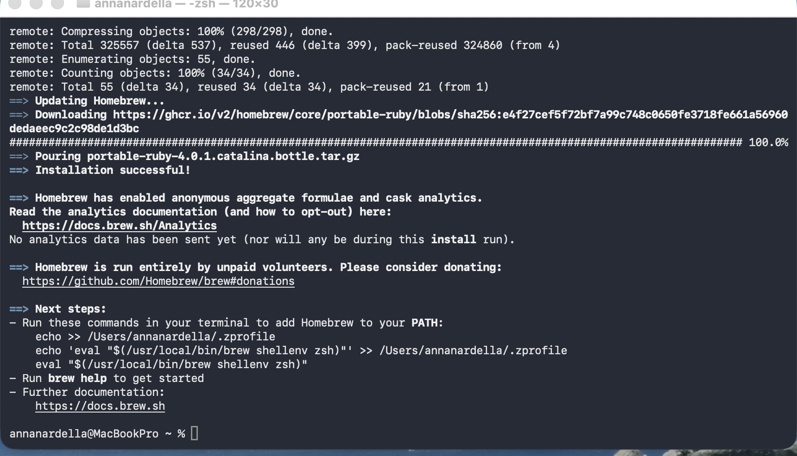

### **Standard ebooks tools**

Finally, you can now use homebrew to install the standard ebooks toolset with: 

```
brew update
brew install standardebooks
```

It takes a while to complete, then you can check the outcome with 

```
se --version
```

Nb it is not clear in the instructions if the pipx instructions are an alternative to the ones using homebrew, I think they are. The above steps do not themselves install pipe

Presumably the other commands you can use are 

To update, the instructions say to use `pipx upgrade standardebooks`

but I suppose for an installation with homebrew you would instead do:

```
brew upgrade standardebooks
```

nb I tried this command and it seemed to work, it told me I already had the latest version installed

## github desktop

This isn't strictly necessary but it might help with authentication and viewing diffs, and I don't want to install VS code just yet.

### Installation

I downloaded github desktop for macbook (intel chip) from here: https://desktop.github.com/download/. This downloads a zip. You double click to extract it and then end up with the application file in the downloads folder, which you then copy to your applications folder in Finder. 

When I launched Github desktop it automatically asked if I wanted to use my github account (acnard, etc.) and I said yes, and had to enter my password for it (the same one I used to sign in to github). Then it asked me to configure git with my account name and email address. 

I didn't accept the defaults offered (the github account name and email address) and instead used just Anna Nardella and nardella.anna@gmail.com. 

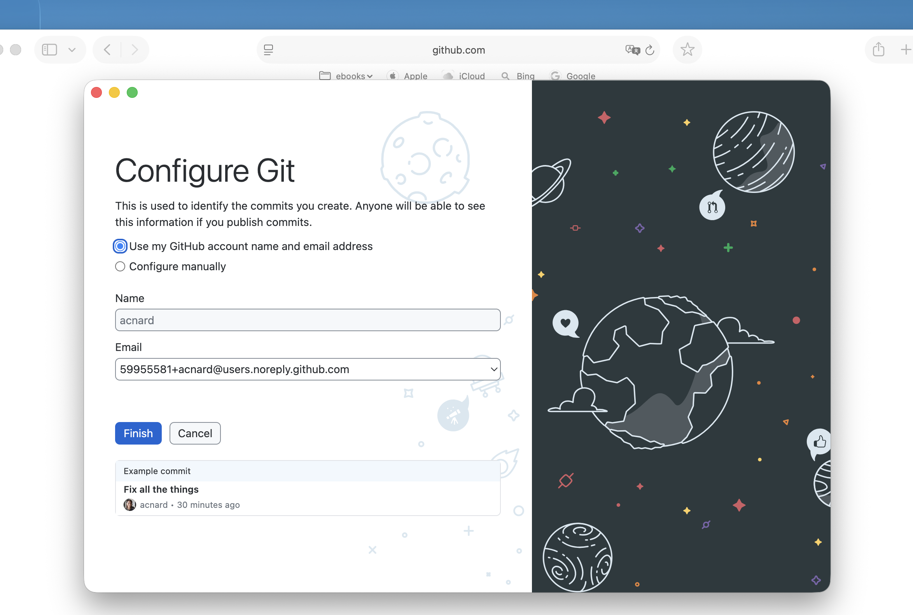

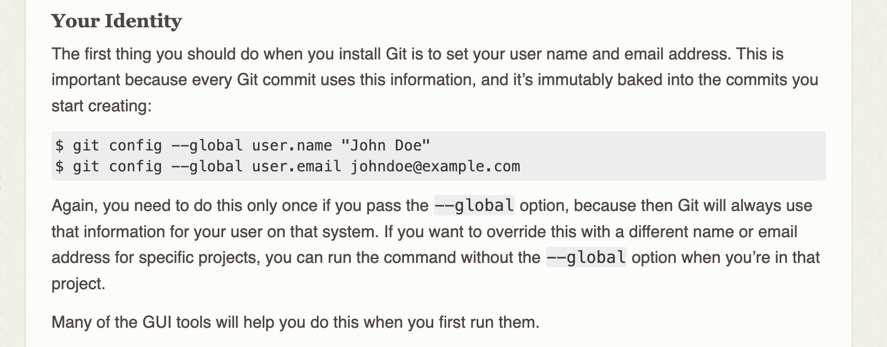

## new repository for testing

I will do this on the command line, not using github desktop, to review my knowledge.

### Create new repo on GitHub

over on GitHub I created a new repository called mac-setupnotes for holding the text in this file. 

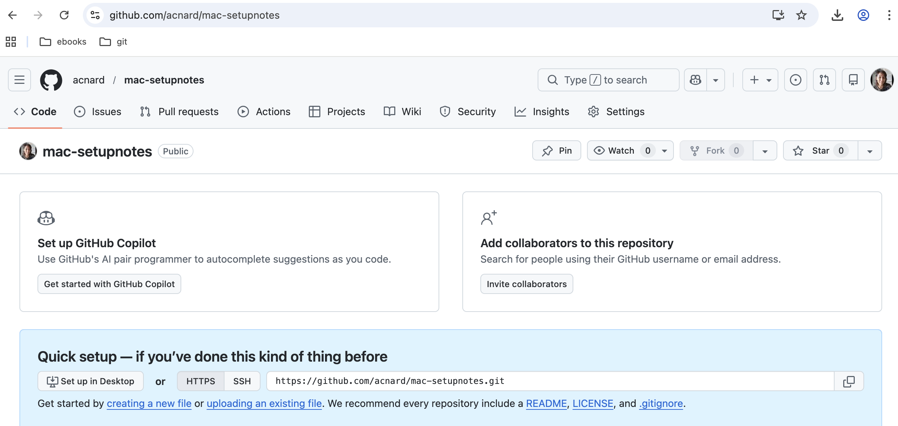

### upload files to github and do inital commit

Now I want to populate this repo with the contents of my SetupNotes folder on the mac

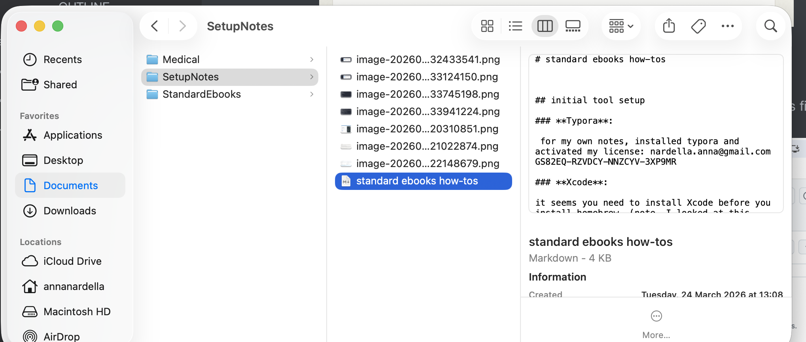

I decided to do this in the only way I know how, meaning I first upload my files (so this .md file plus its images) to the repository on GitHub. So I uploaded all the files in my SetupNotes folder and made an initial commit (directly on github)

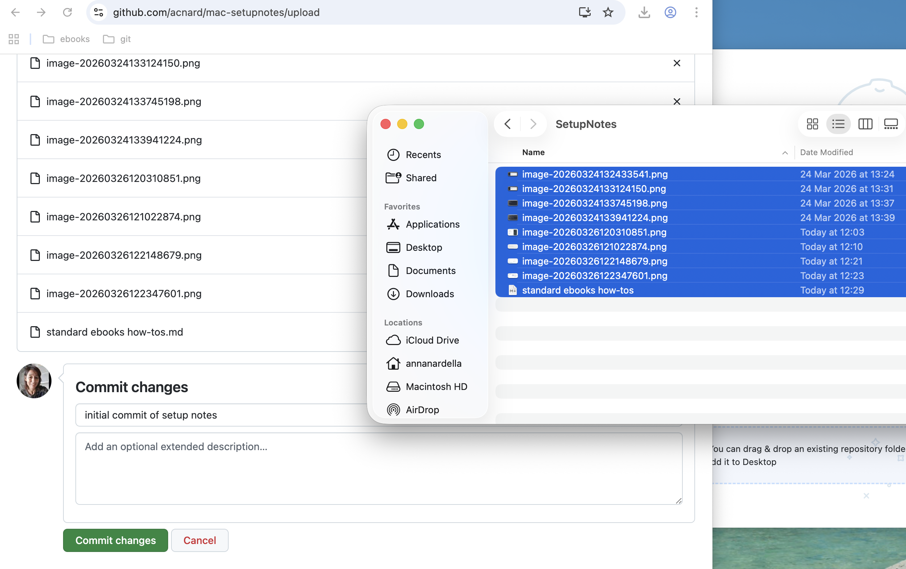

### now clone the github repo to local machine

Now I can use a git command to clone this repo to my local machine. 

So to do this, I need to cd into the folder where I want the repo to be cloned and then use the git clone command. In my case: 

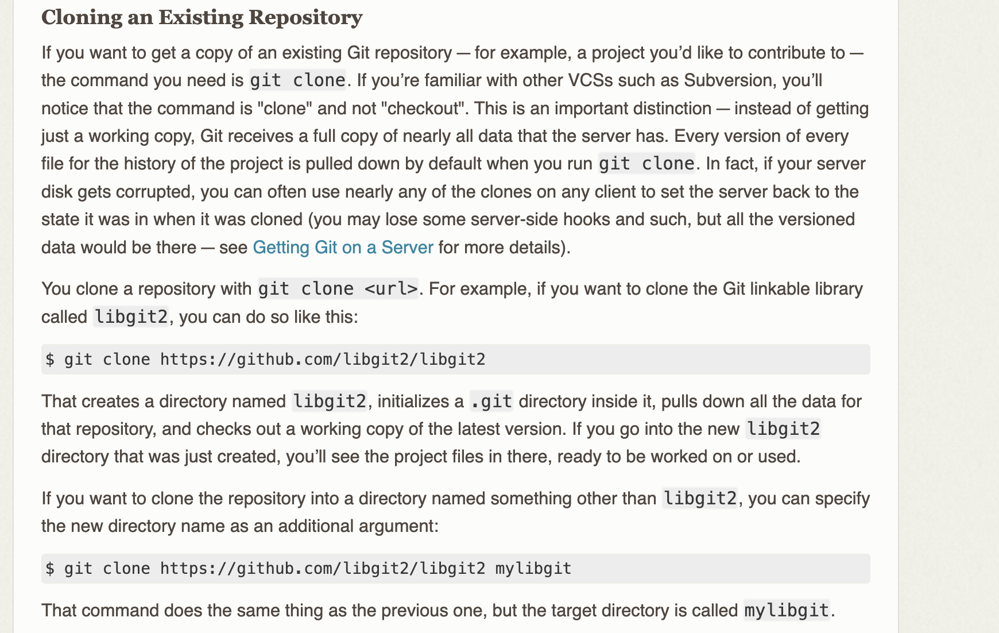

So to do this I cd into the folder I want to use (MyNotes)

and then enter the command `git clone https://github.com/acnard/mac-setupnotes.git`

where the https address is obtained from github.

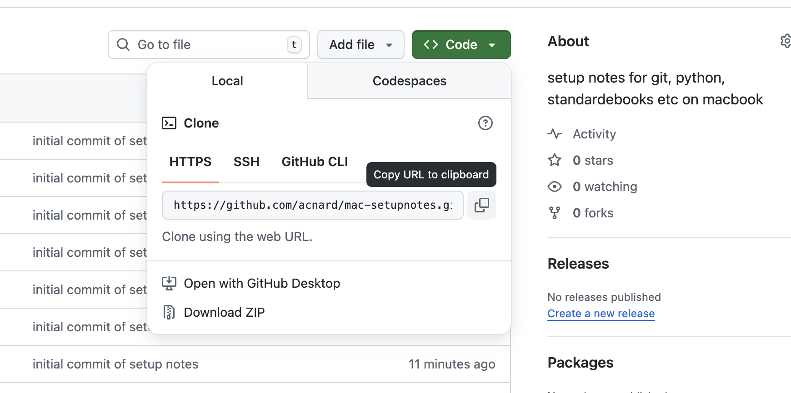

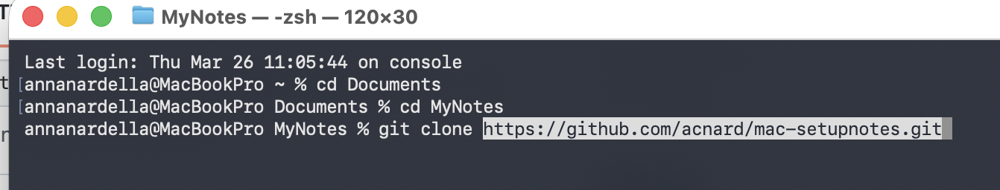

after doing this, I can cd into the newly created subfolder (called mac-setupnotes) and do a git status: it tells me I am up to date with origin.

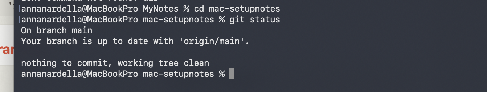

### update the files on local machine

Now I have been working on the old setup notes folder where I have been taking notes. I need to move those changes (updated .md file plus new images) to the mac-setupnotes folder that is under version control, after which  I can delete my initial setupnotes folder. 

Then I can do a `git add -A` followed by a `git commit` and a `git push`.

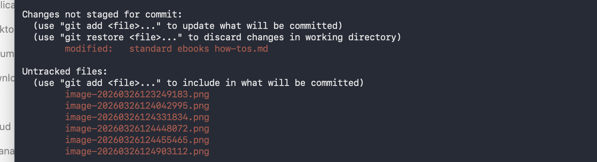

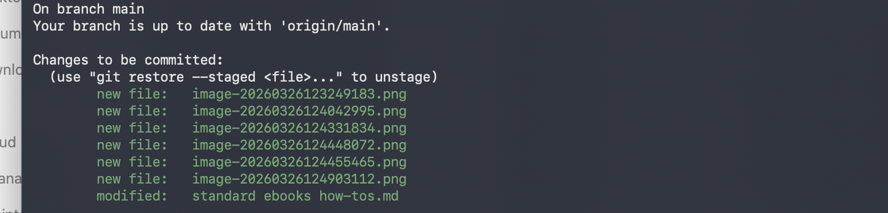

I was able to do the commit using the -m option to enter the commit message directly in the terminal: 

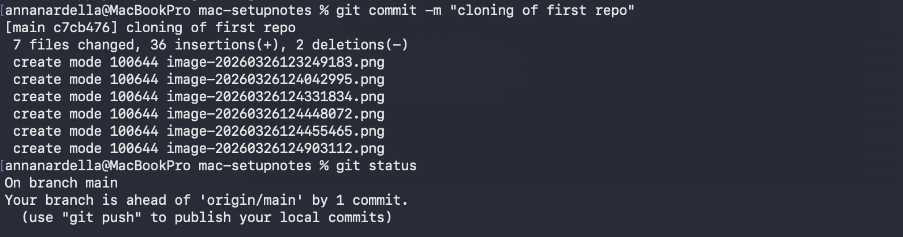

but then the git push failed. It asked me for my github user name and pw but then said that :

> remote: Invalid username or token. Password authentication is not supported for Git operations.fatal: Authentication failed for 'https://github.com/acnard/mac-setupnotes.git/'

### create a token on github 

You can no longer use your username and pw to do a git push from local to remote. Instead, you need to generate a token on github and then, when prompted for your pw on git push paste in that token. Note that the token has an expiration date.

Following the instructions here:

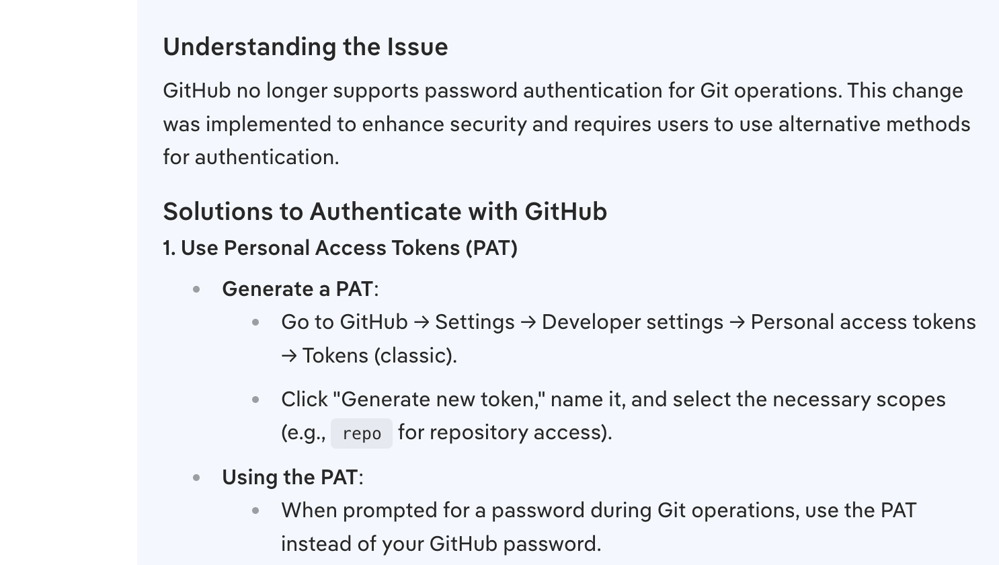

I created a personal access token in GitHub

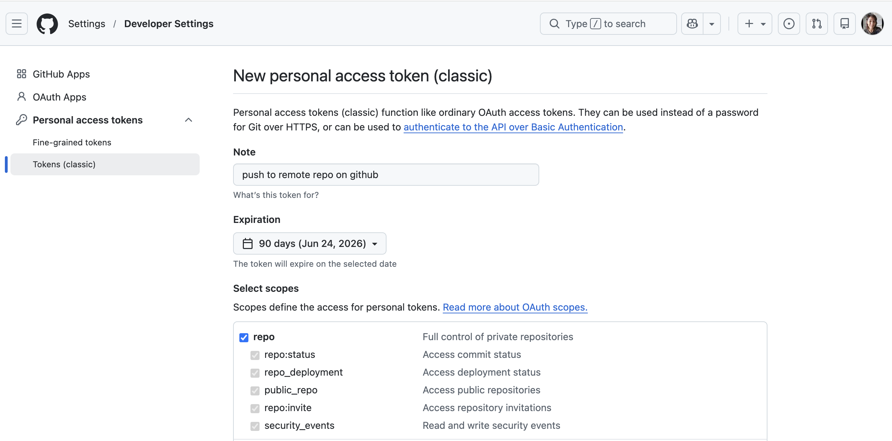

And then copied it to a file on my local machine (you can't access this token again on github).

### do a git push to remote using the token

Then, when after git push, when prompted for my credentials entered acnard for username and then pasted in the token for the password (CAREFUL: do command-V only once, it doesn't show you anything in the command line when you paste). 

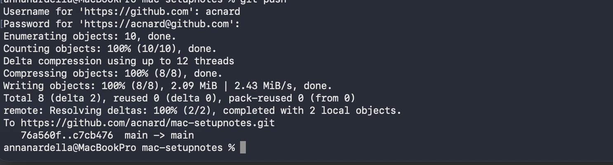

## Summary of git process (command line)

This is assuming you have a repo whose origin is a remote on github and you have cloned it to the local machine using https. 

1. On your local machine, always do a **git fetch** first to retrieve any changes from the remote (especially if you work on the same repo from multiple computers)
2. Then work on the files in your local folder (in this case, mac-setupnotes), updating or adding files as needed. 
3. When you do a **git status** you will be shown the non-commited changes you have made.
   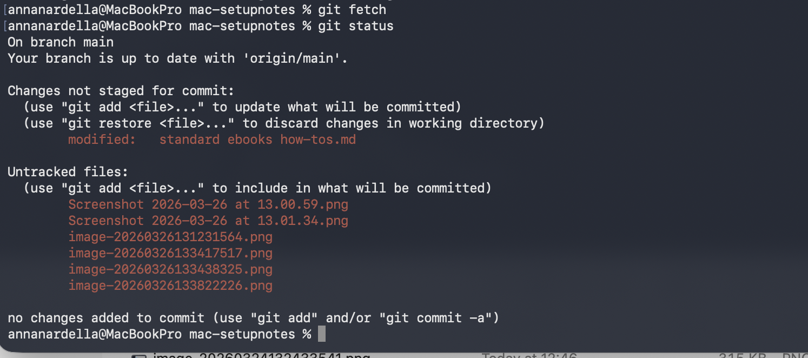
4. Use git add -A to add all chanced or new files to the staging area
    

## Test run for the Grey Mask

For my first production I will produce a book only for myself. I found the Grey Mask here, done by distributed proofreaders in Canada:

Text: https://www.fadedpage.com/showbook.php?pid=20140339 

Scans: https://archive.org/details/bwb_W9-ANO-109/page/192/mode/2up 

The book is published in 1929 so is out of copyright also in the US

### select the starting file to use

There are both html and epub versions. The instructions say to pick the one that appears most accurate. 
In this case the epub and the html seem pretty much the same. I decided to start with the epub.
